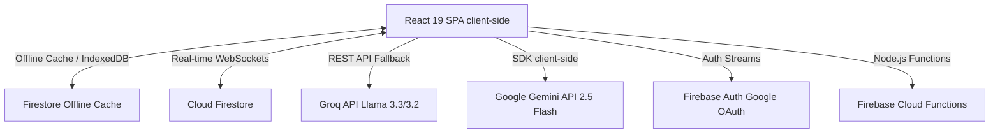

# AI-Powered Smart Shopping Platform – Architecture & System Specification

This document details the architectural design patterns, state management models, data flow, and optimization strategies implemented in the Smart Shopping Platform. It serves as a technical overview for software engineering reviews.

---

## 1. System Architecture & High-Level Design

The application follows an **Offline-First SPA (Single Page Application)** architecture backed by a serverless (FaaS) backend.



### Key Architectural Patterns:
- **Serverless & Event-Driven:** Eliminates standard API server bottlenecks by leveraging Firebase Authentication and Cloud Firestore direct client-side listeners (`onSnapshot`), triggering background Firebase Cloud Functions on document write operations.
- **Offline-First Data Flow:** The application relies on client-side caching to handle writes and reads during network latency or disconnects, syncing delta updates once connection is re-established.
- **PWA standalone mode:** Built via Vite and `vite-plugin-pwa`, registering a Service Worker (`autoUpdate` strategy) to cache static assets (HTML, CSS, JS, local JSON databases) using a cache-first strategy for instant subsequent load times.

---

## 2. Front-End Technical Stack & Build Pipeline
- **Runtime Library:** React 19, exploiting concurrent rendering and optimization strategies to minimize Virtual DOM reconciliation cycles.
- **Build Tool:** Vite, configured with code-splitting, tree-shaking, and ESModule dependency pre-bundling.
- **Type Safety:** TypeScript (mixed with legacy JS, progressively refactored) enforcing strict interfaces for domain models:
  - `ShoppingItem`: ID, check state, price, categories, item metadata, author track.
  - `FamilyGroup`: Members array, unique sharing token, creation timestamps.
  - `PantryItem`: Expiration tracking, quantative thresholds.
- **Animations:** Hardware-accelerated CSS transitions coupled with `framer-motion` for layout animations, reducing layout shifts and maintaining 60 FPS rendering.
- **Drag & Drop Engine:** `@dnd-kit/core` utilizing pointer/touch events and React dynamic Ref arrays to calculate real-time positional overrides.

---

## 3. Resilient AI Pipeline & Fault-Tolerant Circuit Breaker

The core intelligence is driven by a custom-engineered, multi-tier AI pipeline in `aiService.js` that implements a **Circuit Breaker** pattern to handle API rate limits (HTTP 429), timeouts, and quota exhaustion.

### AI Fallback Hierarchy:
1. **Primary Node:** `gemini-2.5-flash` client-side API SDK.
2. **Secondary Node (Failover):** HTTP POST requests to Groq Cloud API (`llama-3.3-70b-versatile` for text and `llama-3.2-11b-vision-preview` for vision inputs).
3. **Tertiary Node (Offline/Local Engine):** Deterministic JavaScript rule-engines simulating LLM output locally when offline or under complete API blackout.

### Resiliency Mechanics:
- **Cooldown Block:** Upon catching a rate-limit error or quota exhaustion from the Gemini SDK, a global flag `geminiDisabledUntil` is set to `Date.now() + 300,000ms` (5 minutes). During this window, all requests bypass the Gemini client and route directly to Groq.
- **Structured Output Constraints:** Prompts enforce strict JSON output syntax. Because JSON output from LLMs can be brittle, a parsing utility (`parseJsonSafely`) extracts content enclosed between the first `{` and last `}` using string index slicing, avoiding JSON parse exceptions caused by markdown wrapper artifacts (e.g. ` ```json ` tags).

---

## 4. Database Schema & State Sync Strategy

### NoSQL Schema Design (Cloud Firestore):
- **`/users/{uid}`:** Tracks profile meta, current authenticated sessions, and `familyId` pointers.
- **`/families/{familyId}`:** Stores the sharing token, creation date, and an array of member UIDs.
- **`/families/{familyId}/shoppingList/{itemId}`:** Tracks the active shopping state. Real-time dynamic sorting uses client-side composite checks (e.g., `checked` boolean, alphabetical `category`, and creation time).
- **`/families/{familyId}/pantry/{itemId}`:** Tracks active pantry stocks, expiration dates, and quantities.

### Local State Persistence:
Firestore is initialized with offline persistence using:
```javascript
initializeFirestore(app, {
  localCache: persistentLocalCache({ tabManager: persistentMultipleTabManager() })
});
```
- **`persistentLocalCache`:** Hydrates the application state from IndexedDB immediately on startup, eliminating the initial loading screen.
- **`persistentMultipleTabManager`:** Synchronizes read/write queues across multiple open browser tabs/windows without duplicate web socket connection connections or double-reading Firestore documents.

---

## 5. Hardware Integration & Computer Vision (OCR)

- **Native QR/Barcode Scanning:** Interacts with the device's native camera stream via `html5-qrcode`. It captures video frames, feeds them into a local Web Assembly (WASM) parser for real-time decoding, and maps matches to the local product database.
- **Receipt OCR Pipeline:**
  1. The user captures/uploads an image of a receipt.
  2. The image is compressed and converted to a Base64 encoded string.
  3. The base64 data along with a strict system prompt is transmitted directly to a Multimodal Vision Model (`gemini-2.5-flash` or Groq's `llama-3.2-11b-vision-preview`).
  4. The model parses the tabular receipt layout (Hebrew OCR challenges, cash register shorthand) and responds with structured JSON:
     ```json
     {
       "store": "Store Name",
       "items": [
         { "name": "Parsed Product Name", "qty": 2, "price": 12.90, "category": "Produce" }
       ]
     }
     ```
  5. The client application iterates over the items array, generating batch writes (`writeBatch`) to commit the items to Firestore atomically.

---

## 6. Performance Optimization Techniques

- **Local Product Indexing:** For instant auto-complete and search input, the catalog is parsed from local JSON files containing thousands of standardized products. The search uses a customized client-side substring index search, bypassing network overhead completely.
- **State Batching:** Real-time updates from Firestore listeners are throttled when multiple concurrent updates occur (e.g. during batch additions) to avoid React rendering thrashing.
- **Network Caching:** Firebase hosting cache-control headers are configured to force-revalidate `index.html` while allowing static JS/CSS assets to be cached long-term.
